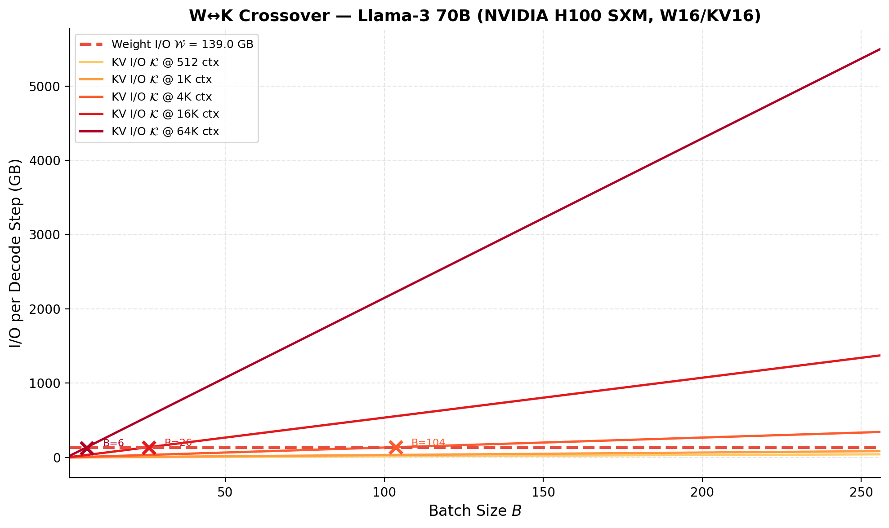
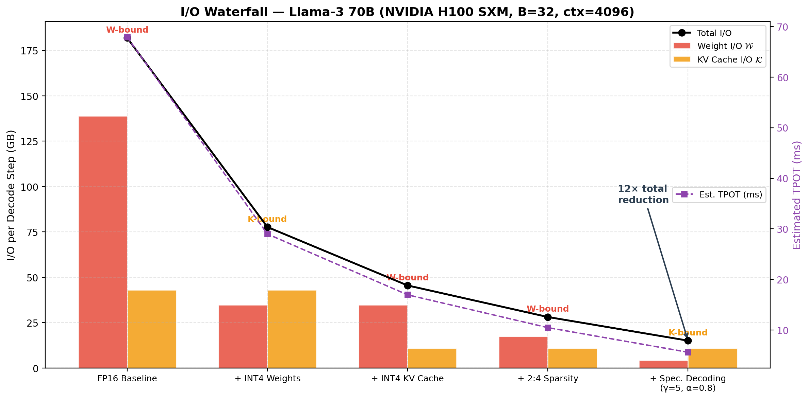

# llm-io-survey

**I/O Bottleneck Analysis Toolkit for LLM Inference**

[](https://arxiv.org/abs/XXXX.XXXXX)
[](LICENSE)
[](https://www.python.org/downloads/)

Companion toolkit for the survey paper:

> **I/O for LLM Inference: A Survey of Storage and Memory Bottlenecks**
> *Author One, Author Two*

Parse any model's architecture (HuggingFace `config.json` or built-in profiles), compute the exact I/O bottleneck breakdown, and generate publication-quality visualizations — all from the command line or a Python script.

<p align="center">
  
  
</p>

Run `llm-io-analyzer figures --outdir figures/` to generate all plots.

---

## Why This Exists

The paper argues that LLM inference is fundamentally I/O-bound, not compute-bound. This toolkit makes that analysis practical and reproducible:

- **Which bottleneck am I hitting?** Weight I/O? KV cache I/O? At what batch size does it switch?
- **How much does INT4 actually help?** Compute the exact bytes saved per decode step.
- **Will my model fit?** Maximum batch size before HBM is exhausted.
- **How do optimizations compose?** Waterfall analysis showing cumulative reduction and diminishing returns.

## Install

```bash
pip install llm-io-survey

# Or from source
git clone https://github.com/YOUR_USERNAME/llm-io-survey.git
cd llm-io-survey
pip install -e .
```

**Requirements:** Python ≥ 3.9, NumPy, Matplotlib.

---

## Quick Start

### Command Line

```bash
# Analyze Llama-3 70B on H100
llm-io-analyzer analyze llama-3-70b

# Analyze with INT4 weights on A100
llm-io-analyzer analyze llama-3-70b --gpu A100 --wbits 4 --ctx 8192

# Analyze any HuggingFace model from its config.json
llm-io-analyzer analyze --config ~/.cache/huggingface/models/config.json

# Plot the batch-size crossover (W↔K transition)
llm-io-analyzer crossover llama-3-70b --save crossover.png

# Compare multiple models side by side
llm-io-analyzer compare llama-3-8b llama-3-70b mixtral-8x7b deepseek-v3

# Generate all paper figures
llm-io-analyzer figures --outdir figures/
```

### Python API

```python
from llm_io_survey import profile_model, plot_crossover, plot_waterfall

# Get full I/O profile
model = profile_model("llama-3-70b")
s = model.summary(gpu="H100", seq_len=4096, batch_size=32,
                   weight_bits=4, kv_bits=16)

print(f"Weight I/O:  {s['weight_io_per_step_gb']:.1f} GB/step")
print(f"KV Cache I/O: {s['kv_io_per_step_gb']:.1f} GB/step")
print(f"Dominant:     {s['dominant_flow']}")
print(f"Est. TPOT:    {s['tpot_ms']:.1f} ms")
print(f"Crossover B:  {s['crossover_batch_size']:.1f}")

# Plot the W↔K crossover
plot_crossover("llama-3-70b", gpu="H100", save_path="crossover.png")

# Waterfall: how optimizations stack
plot_waterfall("llama-3-70b", batch_size=32, save_path="waterfall.png")
```

### Parse Any HuggingFace Model

```python
from llm_io_survey import from_hf_config

# Download config.json from any HF model page, or point to a local one
model = from_hf_config("path/to/config.json")

# Full analysis
print(model.summary(gpu="H100", seq_len=4096))

# Key metrics
print(f"Crossover batch: {model.crossover_batch_size(seq_len=4096):.1f}")
print(f"Max batch (H100): {model.max_batch_size('H100', seq_len=4096)}")
```

---

## Example Output

```
============================================================
  I/O Profile: Llama-3 70B
  GPU: NVIDIA H100 SXM  |  Batch: 1  |  Context: 4096
  Precision: W16 / KV16
============================================================
  Architecture     : GQA
  Total params     : 70.6B
  Active params/tok: 69.5B
  Weight footprint : 141.1 GB
────────────────────────────────────────────────────────────
  Weight I/O (𝒲)   : 139.00 GB / step
  KV Cache I/O (𝒦) : 1.34 GB / step
  Total decode I/O : 140.35 GB / step
  Dominant flow    : W (weight-bound)
────────────────────────────────────────────────────────────
  Arith. intensity : 1.0 FLOP/byte  (ridge: 296)
  Est. TPOT        : 52.4 ms
  W↔K crossover    : B ≈ 103.6
  Max batch (HBM)  : 0 (needs multi-GPU)
  KV / token / layer: 4096 bytes
  KV total (4096 ctx): 1.34 GB
============================================================
```

## Available Visualizations

| Function | Description | Paper Figure |
|---|---|---|
| `plot_roofline()` | Roofline model with decode/prefill operating points | Figure 2 |
| `plot_crossover()` | **Batch-size crossover: where W→K transition occurs** | New |
| `plot_kv_scaling()` | KV cache growth vs context length | Figure 3 |
| `plot_waterfall()` | Cumulative I/O reduction as optimizations stack | Table 7 |
| `plot_hw_scaling()` | GPU compute vs bandwidth across generations | Figure 4 |
| `plot_tpot_heatmap()` | TPOT heatmap across quantization settings | New |
| `plot_model_comparison()` | Side-by-side W vs K across models | New |

## Built-in Models

| Key | Model | Attention | Params |
|---|---|---|---|
| `llama-3.2-1b` | Llama-3.2 1B | GQA | 1.2B |
| `llama-3.2-3b` | Llama-3.2 3B | GQA | 3.2B |
| `llama-3-8b` | Llama-3 8B | GQA | 8.0B |
| `llama-3-70b` | Llama-3 70B | GQA | 70.6B |
| `llama-3-405b` | Llama-3 405B | GQA | 405B |
| `llama-2-7b` | Llama-2 7B | MHA | 6.7B |
| `llama-2-70b` | Llama-2 70B | GQA | 70B |
| `mistral-7b` | Mistral 7B | GQA | 7.3B |
| `phi-3-mini` | Phi-3 Mini | MHA | 3.8B |
| `gemma-2-9b` | Gemma-2 9B | GQA | 9.2B |
| `qwen-2.5-72b` | Qwen-2.5 72B | GQA | 72B |
| `mixtral-8x7b` | Mixtral 8×7B | GQA+MoE | 47B (13B active) |
| `mixtral-8x22b` | Mixtral 8×22B | GQA+MoE | 141B (39B active) |
| `deepseek-v3` | DeepSeek-V3 | MLA+MoE | 671B (37B active) |
| `gpt-3-175b` | GPT-3 175B | MHA | 175B |

## Built-in GPUs

`V100`, `A100`, `H100`, `B200`, `RTX_4090`, `M2_Ultra`, `M4_Max`, `M4_Ultra`

---

## Key Equations (from the paper)

This toolkit implements the three I/O flow equations:

**Weight I/O** (Eq. 5): independent of batch size — batching amortizes this.
```
W = L × (4d² + α·d·d_ff) × b_w/8
```

**KV Cache I/O** (Eq. 6): grows linearly with batch × sequence length.
```
K = L × 2 × B × s × n_kv × d_h × b_kv/8
```

**Crossover**: the batch size where K overtakes W:
```
B_crossover = W / K_per_sequence
```

## Contributing

We welcome contributions! Particularly:

- **New model profiles**: Add entries to `KNOWN_MODELS` in `model_profile.py`
- **New GPU profiles**: Add entries to `GPU_PROFILES` in `hardware.py`
- **New visualizations**: Add plotting functions to `visualize.py`
- **HF config parsing**: Improve coverage of model architectures in `from_hf_config()`

## Citation

If you use this toolkit in your research, please cite our survey:

```bibtex
@article{author2025io,
  title={I/O for LLM Inference: A Survey of Storage and Memory Bottlenecks},
  author={Author One and Author Two},
  journal={arXiv preprint arXiv:XXXX.XXXXX},
  year={2025}
}
```

## License

MIT
